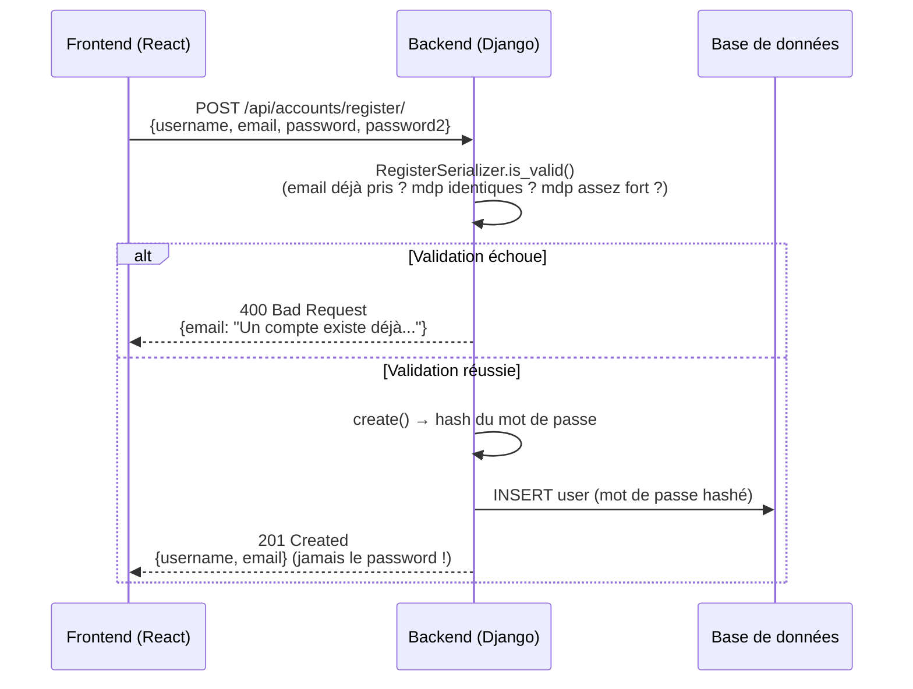
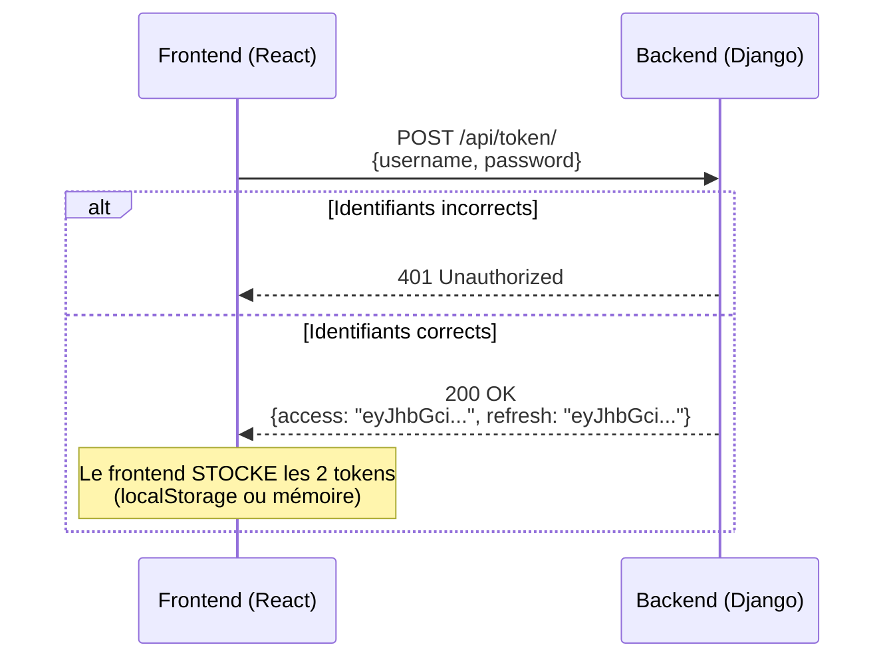
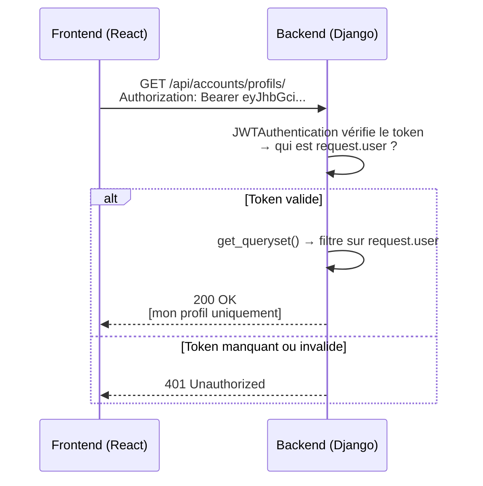
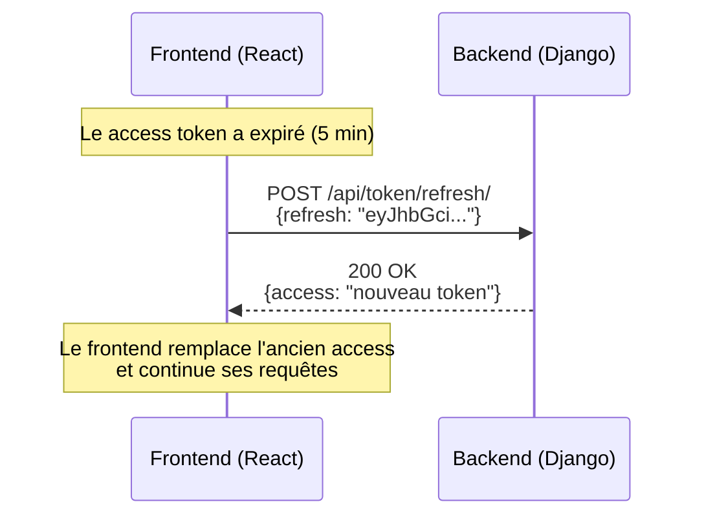

# 🔌 Flux Backend ↔ Frontend — Guide de connexion

> Document de référence pour comprendre **comment le frontend parle au backend**.
> Projet d'apprentissage : chaque étape est expliquée avec le **pourquoi**.

---

## 1. L'architecture en une image

```
┌─────────────────────┐         ┌──────────────────────┐
│      FRONTEND       │  HTTP   │       BACKEND        │
│   (React / Vite)    │ ──────► │   (Django + DRF)     │
│                     │  JSON   │                      │
│  - Affiche les pages│ ◄────── │  - Valide les données│
│  - Envoie les infos │         │  - Parle à la base   │
│  - Stocke le token  │         │  - Renvoie du JSON   │
└─────────────────────┘         └──────────────────────┘
```

**Le principe :** le frontend et le backend ne se connaissent pas. Ils communiquent
uniquement par **requêtes HTTP** qui envoient et reçoivent du **JSON**.

---

## 2. Les endpoints disponibles (les portes du backend)

| Méthode | URL | Rôle | Protégé ? |
|---|---|---|---|
| `POST` | `/api/accounts/register/` | Créer un compte | ❌ Public |
| `POST` | `/api/token/` | Se connecter (obtenir les tokens) | ❌ Public |
| `POST` | `/api/token/refresh/` | Rafraîchir le token expiré | ❌ Public |
| `GET` | `/api/accounts/profils/` | Voir MON profil | ✅ JWT requis |
| `POST` | `/api/accounts/profils/` | Créer MON profil | ✅ JWT requis |
| `GET` | `/api/accounts/profils/1/` | Voir MON profil n°1 | ✅ JWT requis |
| `PUT/PATCH` | `/api/accounts/profils/1/` | Modifier MON profil n°1 | ✅ JWT requis |
| `DELETE` | `/api/accounts/profils/1/` | Supprimer MON profil n°1 | ✅ JWT requis |

---

## 3. Le flux d'inscription (register)



**À retenir :**
- L'inscription est **publique** (pas besoin de token).
- Le mot de passe n'est **jamais** renvoyé (grâce à `write_only`).
- Le mot de passe est **hashé** avant d'être stocké (grâce à `create_user`).

---

## 4. Le flux de connexion (JWT)



**Les 2 tokens :**

| Token | Durée de vie | Rôle |
|---|---|---|
| `access` | ~5 minutes | Envoyé à **chaque** requête protégée |
| `refresh` | ~1 jour | Permet d'obtenir un **nouveau** access sans se reconnecter |

---

## 5. Le flux d'une requête authentifiée



**Le header magique :**
```
Authorization: Bearer <access_token>
```

C'est **la seule façon** pour le backend de savoir qui tu es. Sans ce header, pas de
`request.user`, donc pas d'accès aux profils.

---

## 6. Le flux de rafraîchissement du token



**Pourquoi ce système ?** Si un `access` est volé, il expire en 5 minutes (dégâts
limités). Le `refresh` est gardé précieusement par le frontend et ne voyage que
pour obtenir un nouveau access.

---

## 7. Exemples concrets avec curl (pour tester à la main)

### 7.1 S'inscrire
```bash
curl -X POST http://127.0.0.1:8000/api/accounts/register/ \
  -H "Content-Type: application/json" \
  -d '{"username": "jean", "email": "jean@mail.com", "password": "Motdepasse123!", "password2": "Motdepasse123!"}'
```

### 7.2 Se connecter (récupérer les tokens)
```bash
curl -X POST http://127.0.0.1:8000/api/token/ \
  -H "Content-Type: application/json" \
  -d '{"username": "jean", "password": "Motdepasse123!"}'
```

### 7.3 Accéder à son profil (avec le token)
```bash
curl http://127.0.0.1:8000/api/accounts/profils/ \
  -H "Authorization: Bearer <ACCESS_TOKEN>"
```

### 7.4 Rafraîchir le token
```bash
curl -X POST http://127.0.0.1:8000/api/token/refresh/ \
  -H "Content-Type: application/json" \
  -d '{"refresh": "<REFRESH_TOKEN>"}'
```

---

## 8. Ce que le frontend doit retenir (checklist)

1. **À l'inscription** → `POST /register/` → si `201`, rediriger vers la connexion.
2. **À la connexion** → `POST /token/` → stocker `access` et `refresh`.
3. **À chaque requête protégée** → ajouter le header `Authorization: Bearer <access>`.
4. **Quand le serveur répond `401`** → le access a expiré → appeler `/token/refresh/` → réessayer.
5. **À la déconnexion** → supprimer les tokens (le backend n'a rien à faire).

---

## 9. Les pièges à éviter (leçons apprises)

| Piège | Conséquence | Solution |
|---|---|---|
| Stocker le token dans `localStorage` | Volable par XSS | Mémoire ou `httpOnly` cookie (plus avancé) |
| Envoyer le mot de passe en clair dans l'URL | Visible dans les logs | Toujours dans le **body** JSON, jamais en query string |
| Oublier le header `Authorization` | `401` systématique | Toujours l'ajouter aux requêtes protégées |
| Renvoyer le mot de passe dans la réponse | Faille de sécurité | `write_only=True` sur le champ password |

---

## 10. Pour la marketplace (ce qui va changer)

Ce flux est **la fondation**. Quand tu construiras la marketplace, tu réutiliseras
exactement le même mécanisme, avec plus de ressources :

```
/api/token/              → connexion (inchangé)
/api/accounts/profils/   → profil client (inchangé)
/api/vendeurs/           → profils vendeurs (même pattern)
/api/produits/           → produits (public en lecture, protégé en écriture)
/api/commandes/          → commandes (protégé, scoping par utilisateur)
```

**La règle d'or qui ne change jamais :**
> Un utilisateur ne voit et ne modifie que **SES** données.
> `get_queryset()` + `perform_create()` + `IsAuthenticated` = le trio sécurité.